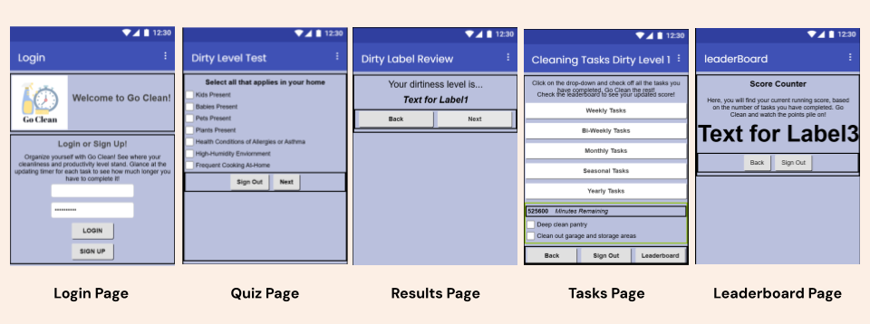
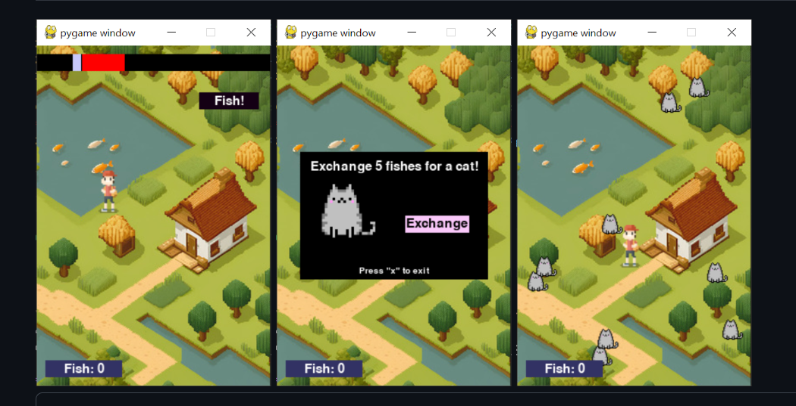

# Shirlyn Dong – Personal Website

This is a personal website built using **HTML** and **CSS** to showcase my background, technical skills, and software projects. The site includes a homepage with personal and academic information, and a portfolio page that highlights several projects I've worked on. The website was fully designed and developed by me.

https://github.com/user-attachments/assets/96ce9a27-1fac-4d70-8ad5-64e9887f9fee

## Features

- Homepage with background, interests, and technical skills  
- Portfolio page featuring detailed project descriptions and screenshots  
- Navigation bar for seamless page switching  
- Footer with contact info and LinkedIn link  
- Semantic HTML structure with accessible elements

## Usage

1. Open `index.html` in a web browser to view the homepage.  
2. Use the navigation bar to access the `portfolio.html` page.  
3. Modify `index.html`, `portfolio.html`, and `style.css` to customize content and design.

## Project Highlights

### Go Cleaning App

A gamified cleaning and habit-tracking app developed with **MIT App Inventor**.  
Users calculate a personalized "Dirty Level" based on their daily habits and receive a cleaning schedule with countdown timers. Completing tasks earns points and encourages better routines.

**Built With:** MIT App Inventor  
**Collaboration:** Pair project  
**Focus Areas:** Gamification, user engagement, time-based functionality

### Fishing Cat Game

A 2D fishing game created with **Python** and **Pygame**.  
Players navigate with keyboard controls, fish using timing-based mechanics, and exchange catches for in-game items (cats). The game includes sprite handling, interactive zones, and a basic shop system.

**Built With:** Python, Pygame  
**Focus Areas:** Event handling, game loop design, interactive input

### Math Dog Simulator

An educational math game developed in **Java** using **Java Swing**.  
Players solve randomly generated math problems against a timer to increase their "strength" and defeat mystery opponents. The game includes sound effects and animated UI feedback.

**Built With:** Java, Java Swing  
**Focus Areas:** Random logic, UI interaction, audio integration

## Built With

- HTML  
- CSS  
- JavaScript (included for future interactivity)  
- Local assets stored in the `assets/` folder

## Acknowledgements

All content and code created by **Shirlyn Dong**.  
Images are from my own project work or created by me.
This website was initially built using the **Girls Who Code Replit template**, which provided the project structure and starter files.
